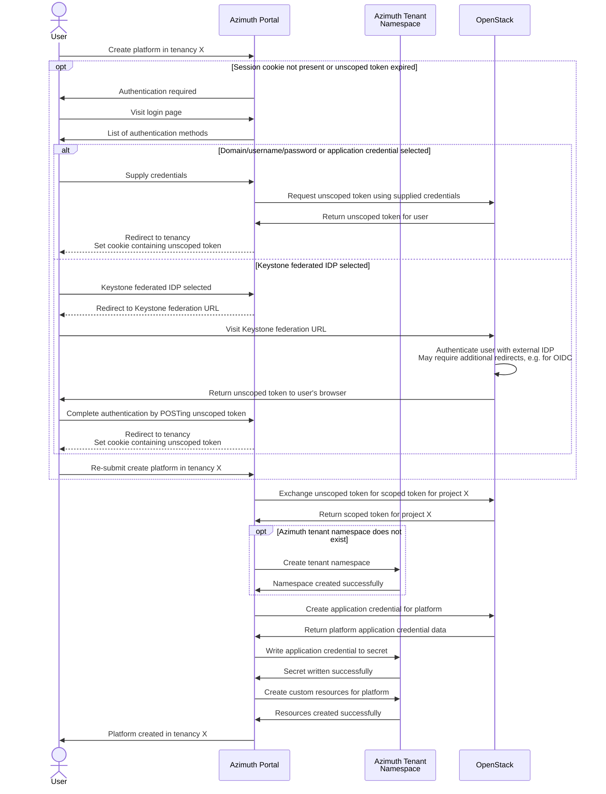
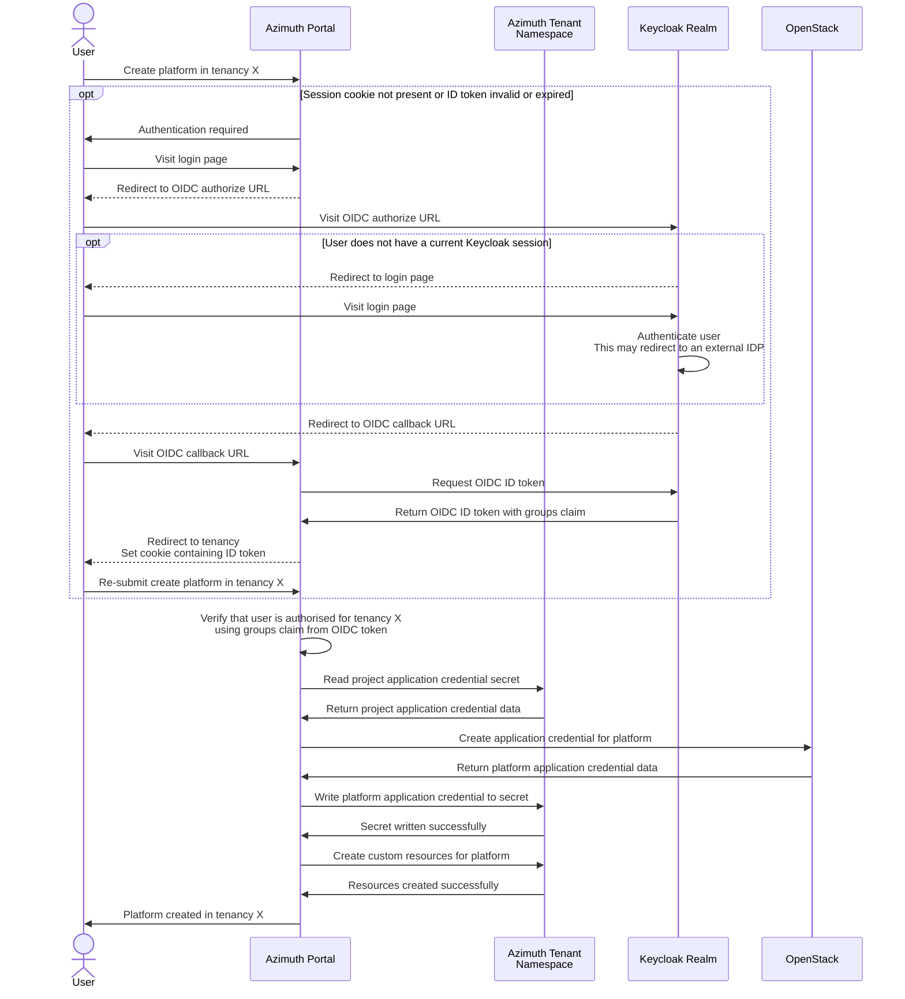
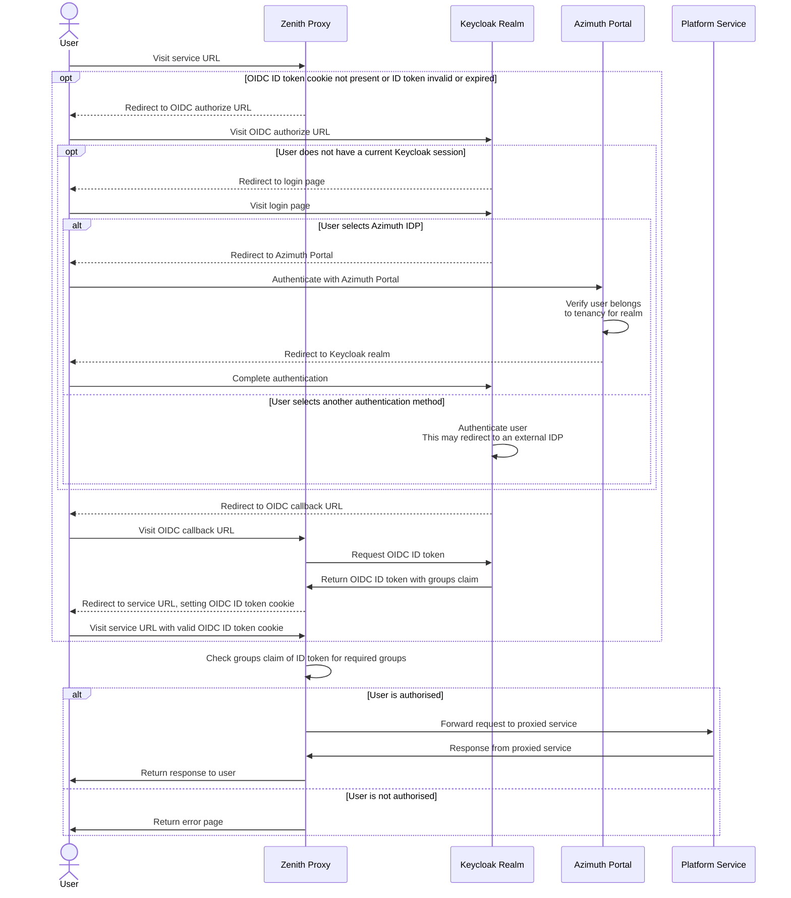

# Identity in Azimuth

This document explains how identity is designed to work in Azimuth.

## Personas

Azimuth has two distinct personas that consume Azimuth and the platforms that are deployed
using it - **platform admins** and **platform users**.

**Platform admins** are able to access the Azimuth portal where they can administer platforms
in their tenancies and the platform users that are able to access the services for those
platforms (e.g. Jupyter Notebooks, Guacamole web desktops, monitoring dashboards).

**Platform users** are able to access platform services to which they have been granted access
by a platform admin. They do not need to be able to sign in to the Azimuth portal or even be
aware that the platform is deployed in an Azimuth tenancy.

By default, platform admins are also platform users that are authorised to access all of the
services for platforms deployed in their tenancies.

## Technologies

Azimuth utilises Kubernetes Ingress, Keycloak and Zenith to implement secure access to Azimuth
and the platforms deployed using it.

### Kubernetes Ingress

Azimuth and Zenith leverage Kubernetes Ingress as a dynamically configurable HTTP(S) proxy to
route external traffic to the correct Kubernetes service based on the hostname and/or path.

### Keycloak

As part of an Azimuth installation, a Keycloak instance is deployed. Azimuth uses this Keycloak
instance to provide authentication and authorisation for platform services exposed using Zenith,
and optionally for Azimuth itself.

### Zenith

Zenith is a tunnelling HTTP(S) proxy that is used by Azimuth to expose platform services. Using
Zenith allows Azimuth to expose platform services that are behind a NAT or firewall without
consuming public IPs.

Zenith uses a server/client model where a client initiates a secure SSH tunnel with the server
for the service that wants to be proxied. The server then forwards traffic for the proxied service
back down the tunnel. This is accomplished by creating a Kubernetes `Service` for each Zenith
service and using Kubernetes Ingress to route traffic to the correct service based on the hostname.

Zenith is able to perform TLS termination and single sign-on using OpenID Connect (OIDC) for
proxied services before forwarding traffic to them. This is implemented by configuring the
Kubernetes `Ingress` resources appropriately - in particular the OIDC authentication and
authorisation is implemented using an auth subrequest.

## Accessing Azimuth

An Azimuth operator can configure authentication and authorization for Azimuth itself using
either OpenStack credentials directly or using a realm in the Azimuth-managed Keycloak. Each
mechanism has pros and cons.

An "Azimuth tenancy" is essentially a `Namespace` in the Azimuth Kubernetes cluster that holds
the platform definitions and related resources for that tenancy (implemented as Kubernetes custom
resources). Currently, these tenancies have a one-to-one mapping with OpenStack projects.

In order to manage platform resources in the underlying cloud on behalf of users, Azimuth needs
to be able to translate an authenticated Azimuth session into two things:

  1. A list of Azimuth tenancies that a user is permitted to access
  2. A credential that is able to manage resources in the corresponding OpenStack project

This section documents how this is acheived for each authentication method.

### Using OpenStack credentials

Azimuth allows authenticating directly using credentials for the underlying OpenStack cloud,
with support for domain/username/password, application credentials and Keystone federated
identity providers.

In each case, Azimuth obtains a token that can be used to interact with the OpenStack APIs on
behalf of the user. This token is _unscoped_, i.e. not associated with a specific OpenStack
project, but can be used to query the OpenStack projects that the user has access to - these
projects correspond to the Azimuth tenancies that the user can access. Once the user enters
a tenancy context in Azimuth, the unscoped token can be exchanged for a _project-scoped_ token
that allows Azimuth to manage resources in the OpenStack project.

When authenticating using OpenStack credentials, Azimuth will create the corresponding tenant
namespaces automatically when required.

The following sequence diagram shows a typical flow for creating a platform in an Azimuth
tenancy using OpenStack authentication:

### Using a Keycloak realm

!!! warning  "Technology preview"

    This authentication method is currently in technology preview and not recommended for
    production.

    Fully automated configuration of the Keycloak realm is not yet supported in `azimuth-ops`,
    so it is recommended that you enable backups for your Azimuth installation in order to
    preserve the Keycloak database in the case of an unrecoverable failure.

Azimuth also supports authenticating against a special realm in the Keycloak instance that is
deployed as part of an Azimuth installation. When using this authentication method, it is no
longer required that platform admins have accounts on the underlying OpenStack cloud - the
Azimuth operator can configure the Keycloak realm with any identity providers (e.g. Microsoft
Entra, Google, LDAP, OIDC) and policies (e.g. MFA) that are supported by Keycloak that they
need for users signing in to Azimuth.

In this authentication method, an Azimuth tenant namespace must be _pre-created_ for each
OpenStack project that you want to use with Azimuth and a group must exist in the Keycloak
realm that is used to grant access to this tenancy - `azimuth-ops` handles the creation of
these namespaces and groups for the projects listed in your Azimuth configuration. Keycloak
can be configured to automatically map users from federated identity providers into these
groups if desired, or users can be manually added to the groups as needed.

Azimuth authenticates users against the Keycloak realm using OpenID Connect, and the `groups`
claim from the resulting token is used to determine which Azimuth tenancies the user is
permitted to access.

#### Obtaining an OpenStack credential

Because users no longer have OpenStack credentials, Azimuth must now own the credentials that
are used to provision resources in the underlying cloud on behalf of users. For each OpenStack
project that you want to use Azimuth with, an application credential must be _pre-created_ and
stored in a `Secret` in the corresponding Azimuth tenant namespace. `azimuth-ops` handles the
creation of these secrets, but not the creation of the application credentials themselves -
these must be created ahead of time and placed in your Azimuth configuration.

!!! warning  "Unrestricted application credentials"

    The application credentials must be **unrestricted**, meaning that they have the ability
    to create additional application credentials. This is so that Azimuth can still create the
    per-platform application credentials that are used to manage platform resources.

!!! tip  "Service account recommended"

    It is recommended that Azimuth has a service account in the underlying OpenStack that owns
    the application credentials used by Azimuth. This service account will need to belong to all
    the projects that you wish to use Azimuth with.

    This avoids all of the application credentials used by Azimuth being tied to an individual
    OpenStack user who may have access to the cloud revoked, e.g. if they leave the organisation.

The following sequence diagram shows a typical flow for creating a platform in an Azimuth
tenancy using the Keycloak realm for authentication:

## Accessing platform services

Access to platform services in Azimuth is mediated using Keycloak, regardless of how the user
authenticates with Azimuth and the mechanism for obtaining a cloud credential.

Azimuth manages a realm in Keycloak for each Azimuth tenancy, and the platform users for a
tenancy are users that exist in the associated Keycloak realm. These users can be local Keycloak
users or users from a federated identity provider such as Microsoft Entra, Google or LDAP.

By default, this realm has a single federated IDP that allows users belonging to the tenancy to
sign in using their existing Azimuth session (i.e. platform admins). Users that sign in using
this method are automatically added to an `admins` group that allows them to administer the realm
and grants access to all platform services for the tenancy. Platform admins are able to manage
local users and federated identity providers in this realm as required for their needs.

Within this realm, Azimuth then manages an OpenID Connect client for each platform service and
a group that is used to grant access to that service. Zenith is configured to use this OIDC
client and group when performing authentication and authorisation for the service.

Platform admins can grant a platform user access to a platform service by adding them to the
group for that service. Keycloak has powerful features for automatically mapping users from
federated identity providers into groups if desired.

The following diagram shows the sequence of actions for a user accessing a platform service:

