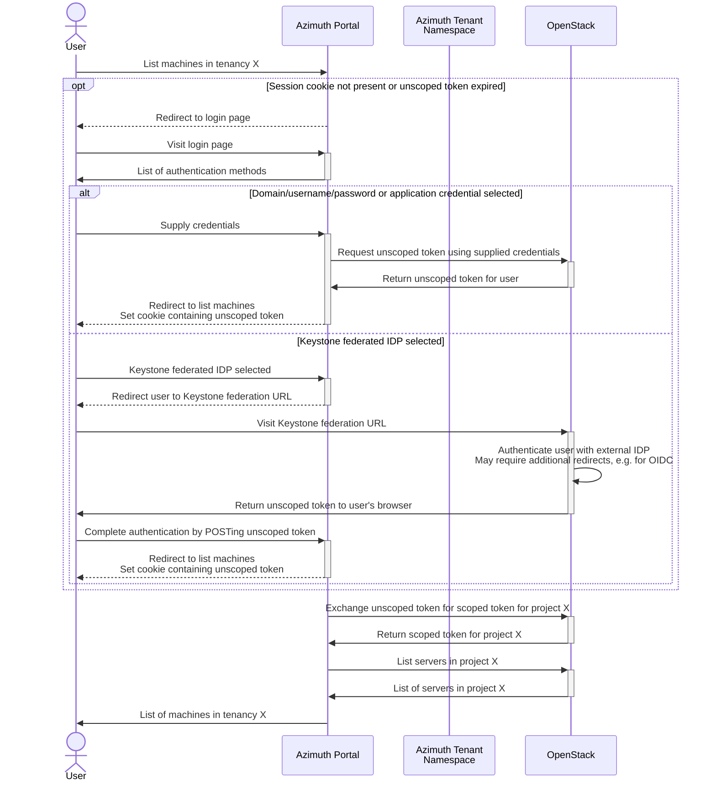
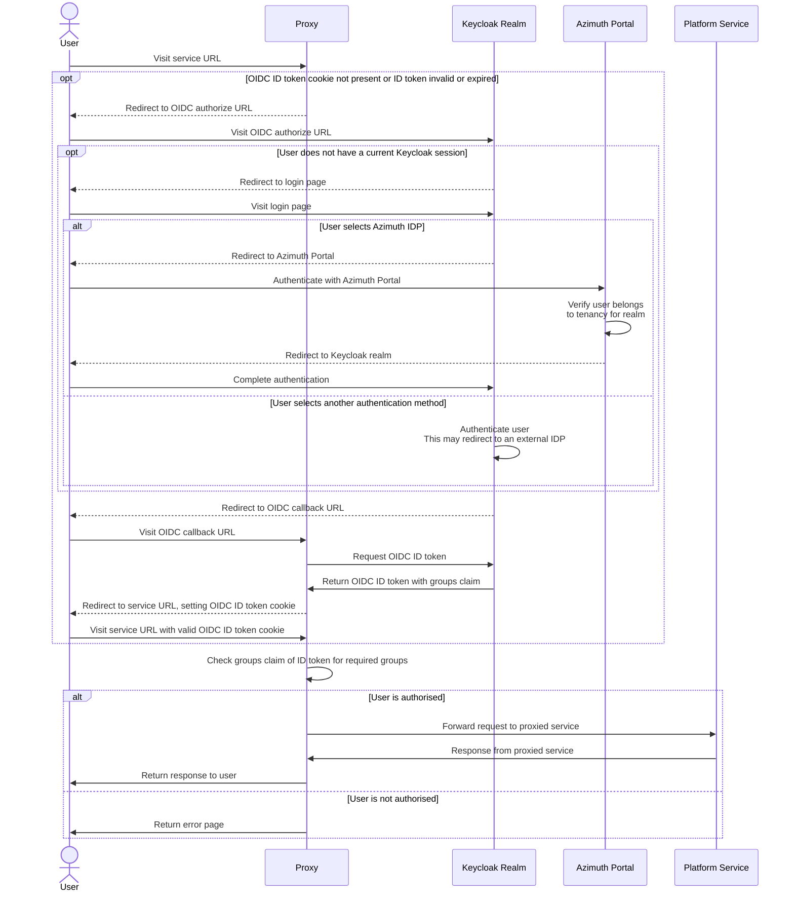

# Identity in Azimuth

This document explains how identity is designed to work in Azimuth.

## Personas

Azimuth has two distinct personas that consume Azimuth and the platforms that are deployed
using it - **platform admins** and **platform users**.

**Platform admins** are able to access the Azimuth portal where they can administer platforms
in their tenancies and the platform users that are able to access the services for those
platforms (e.g. Jupyter Notebooks, Guacamole web desktops, monitoring dashboards).

**Platform users** are able to access platform services to which they have been granted access
by a platform admin. They do not need to be able to sign in to the Azimuth portal or even be
aware that the platform is deployed in an Azimuth tenancy.

By default, platform admins are also platform users that are authorised to access all of the
services for platforms deployed in their tenancies.

## Technologies

Azimuth utilises Kubernetes Ingress, Zenith and Keycloak to implement secure access to Azimuth
and the platforms deployed using it.

### Kubernetes Ingress

Azimuth and Zenith leverage Kubernetes Ingress as a dynamically configurable HTTP(S) proxy to
route external traffic to the correct service based on the hostname and/or path.

### Zenith

Zenith is a tunnelling HTTP(S) proxy that is used by Azimuth to expose platform services. Using
Zenith allows Azimuth to expose platform services that are behind a NAT or firewall without
consuming public IPs.

Zenith uses a server/client model where a client initiates a secure SSH tunnel with the server
for the service that wants to be proxied. The server then forwards traffic for the proxied service
back down the tunnel. This is accomplished by creating a Kubernetes `Service` for each Zenith
service and using Kubernetes Ingress to route traffic to the correct service based on the hostname.

Zenith is able to perform TLS termination and single sign-on using OpenID Connect (OIDC) for
proxied services before forwarding traffic to them. This is implemented by configuring the
Kubernetes `Ingress` resources appropriately - in particular the OIDC authentication and
authorisation is implemented using an auth subrequest.

### Keycloak

As part of an Azimuth installation, a Keycloak instance is deployed. Azimuth uses this Keycloak
instance to provide authentication and authorisation for platform services exposed using Zenith,
and optionally for Azimuth itself.

## Accessing Azimuth

Azimuth allows an Azimuth operator to configure authentication and authorization for Azimuth
itself using either OpenStack credentials directly or using a Keycloak realm to manage users.

An "Azimuth tenancy" is essentially a `Namespace` in the Azimuth Kubernetes cluster that holds
the platform definitions and related resources for that tenancy (implemented as Kubernetes custom
resources). Currently, these tenancies have a one-to-one mapping with OpenStack projects.

In order to manage platform resources in the underlying cloud on behalf of users, Azimuth needs
to be able to translate an authenticated Azimuth session into two things:

  1. A list of Azimuth tenancies that a user is permitted to access
  2. A credential that is able to manage resources in the corresponding OpenStack project

This section documents how this is acheived for each authentication method.

### Using OpenStack credentials

Azimuth allows authenticating directly using credentials for the underlying OpenStack cloud,
with support for domain/username/password, application credentials and federated identity
providers configured in Keystone.

In each case, Azimuth obtains a token that can be used to interact with the OpenStack APIs on
behalf of the user. This token is _unscoped_, i.e. not associated with a specific OpenStack
project, but can be used to query the OpenStack projects that the user has access to (and hence
the Azimuth tenancies). Once the user enters a tenancy context in Azimuth, the unscoped token
can be exchanged for a _project-scoped_ token that allows Azimuth to manage resources in the
OpenStack project.

## Accessing platform services

Access to platform services in Azimuth is mediated using Keycloak, regardless of how the user
authenticates with Azimuth and the mechanism for obtaining a cloud credential.

Azimuth manages a realm in Keycloak for each Azimuth tenancy, and the platform users for a
tenancy are users that exist in the associated Keycloak realm. These users can be local Keycloak
users or users from a federated identity provider such as Microsoft Entra, Google or LDAP.

By default, this realm has a single federated IDP that allows users belonging to the tenancy to
sign in using their existing Azimuth session (i.e. platform admins). Users that sign in using
this method are automatically added to an `admins` group that allows them to administer the realm
and grants access to all platform services for the tenancy. Platform admins are able to manage
local users and federated identity providers in this realm as required for their needs.

Within this realm, Azimuth then manages an OpenID Connect client for each platform service and
a group that is used to grant access to that service. Zenith is configured to use this OIDC
client and group when performing authentication and authorisation for the service.

Platform admins can grant a platform user access to a platform service by adding them to the
group for that service. Keycloak has powerful features for automatically mapping users from
federated identity providers into groups if desired.

The following diagram shows the sequence of actions for a user accessing a platform service:

