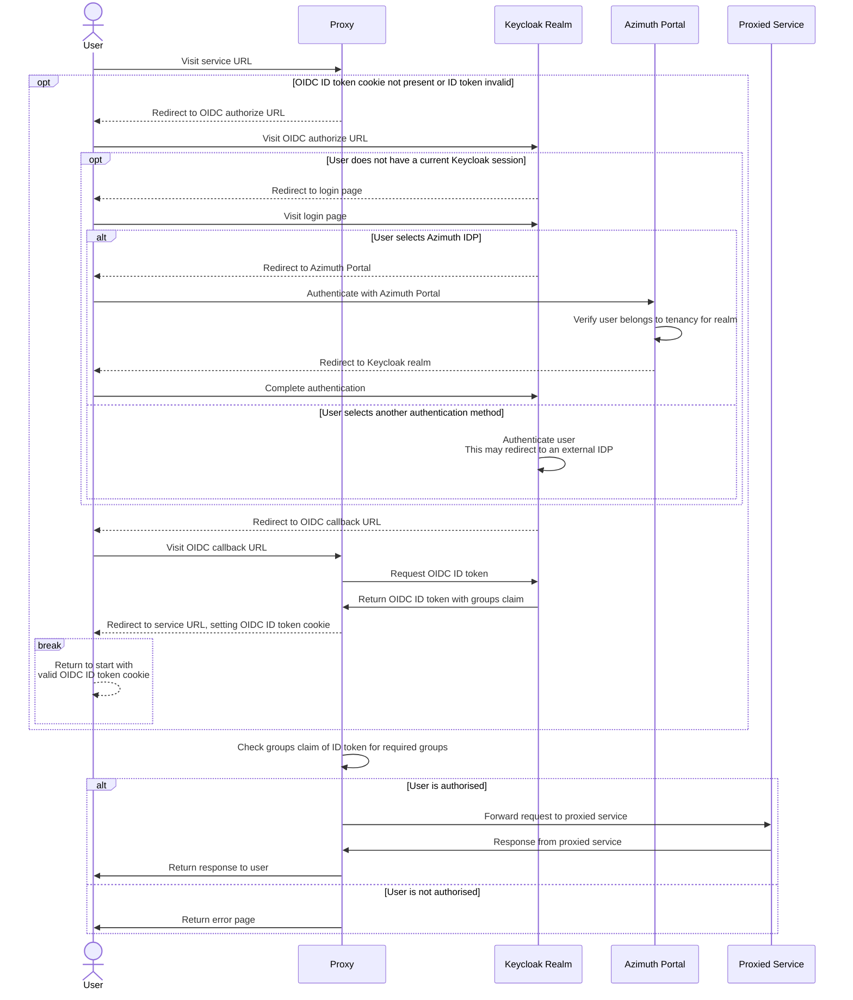

# Identity in Azimuth

This document explains how identity is designed to work in Azimuth.

## Personas

Azimuth has two distinct personas that consume Azimuth and the platforms that are deployed
using it - **platform admins** and **platform users**.

**Platform admins** are able to access the Azimuth portal where they can administer platforms
in their tenancies and the platform users that are able to access the services for those
platforms (e.g. Guacamole web desktops, monitoring dashboards).

**Platform users** are able to access platform services to which they have been granted access
by a platform admin. They do not need to be able to sign in to the Azimuth portal or even be
aware that the platform is deployed in an Azimuth tenancy.

By default, platform admins are also platform users that are authorised to access all of the
services for platforms deployed in their tenancies.

## Technologies

Azimuth utilises Kubernetes Ingress, Zenith and Keycloak to implement secure access to platform
services without consuming any public IP addresses.

### Kubernetes Ingress

Azimuth and Zenith leverage Kubernetes Ingress as a dynamically configurable HTTP(S) proxy to
route external traffic to the correct service based on the hostname and/or path.

### Zenith

Zenith is a tunnelling HTTP(S) proxy that is used by Azimuth to expose platform services. Using
Zenith allows Azimuth to expose platform services that are behind a NAT or firewall without
consuming public IPs.

Zenith uses a server/client model where a client initiates a secure SSH tunnel with the server
for the service that wants to be proxied. The server then forwards traffic for the proxied service
back down the tunnel. This is accomplished by creating a Kubernetes `Service` for each Zenith
service and using Kubernetes Ingress to route traffic to the correct service based on the hostname.

Zenith is able to perform TLS termination and single sign-on using OpenID Connect (OIDC) for
proxied services before forwarding traffic to them. This is implemented by configuring the
Kubernetes `Ingress` resources appropriately - in particular the OIDC authentication and
authorisation is implemented using an auth subrequest.

### Keycloak

As part of an Azimuth installation, a Keycloak instance is deployed. Azimuth uses this Keycloak
instance to provide authentication and authorisation for platform services exposed using Zenith.

Azimuth manages a realm in Keycloak for each OpenStack project in which platforms are deployed.
By default, this realm has a single federation that allows users to sign in using their existing
Azimuth session. Users that sign in using this method are automatically added to an `admins`
group that allows them to administer the realm and grants access to all platform services.
Platform admins are able to create local users in this realm and add federations to other identity
sources e.g. Microsoft Entra, Google or LDAP.

Within that realm, Azimuth then manages an OpenID Connect client for each platform service and
a group that is used to grant access to that service. Zenith is configured to use this OIDC
client and group when performing authentication and authorisation for the service.

Platform admins can grant a platform user access to a platform service by adding them to the
group for that service. Keycloak has powerful features for automatically mapping users from
federated user sources into groups if desired.

## Accessing platform services

The following diagram shows the sequence of actions for a user accessing a platform service in
Azimuth. This diagram is the same regardless of how the user authenticates with Azimuth and
the mechanism for obtaining a cloud credential:

